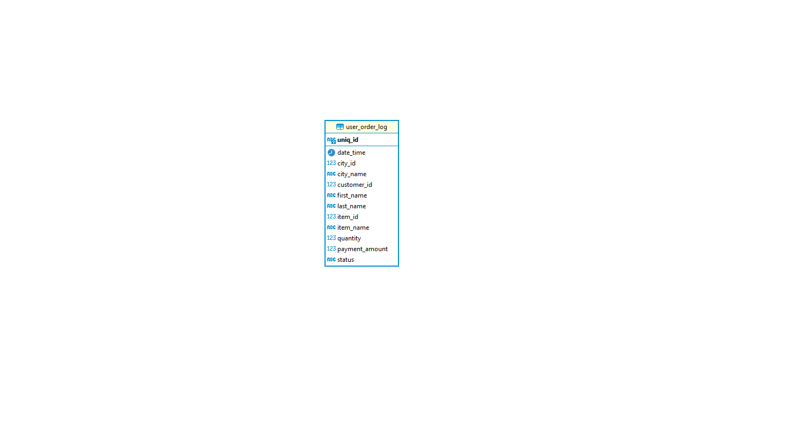
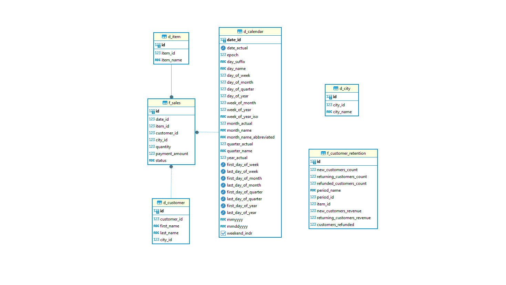
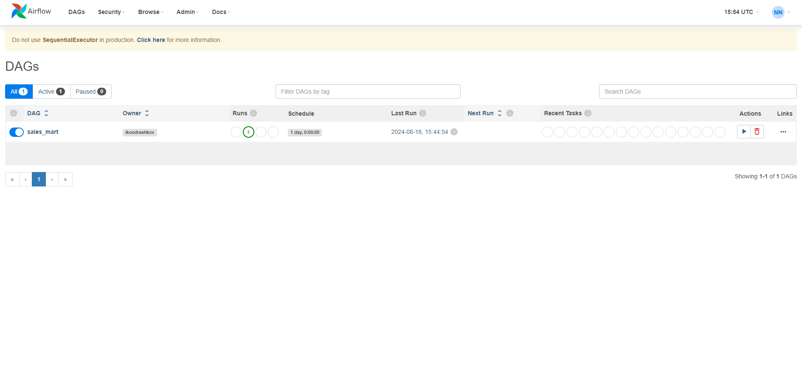
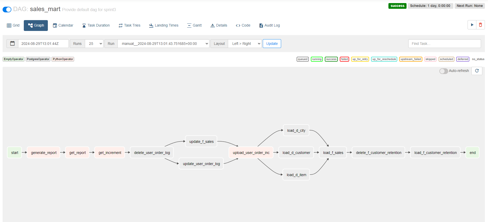
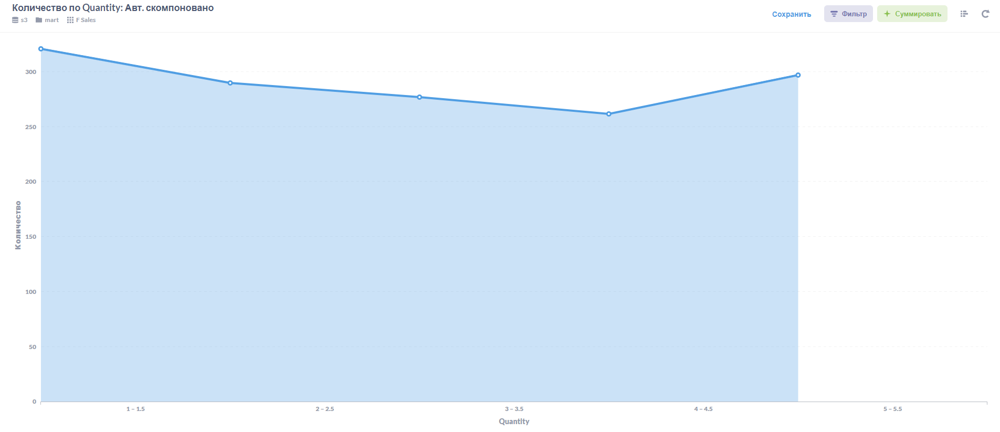
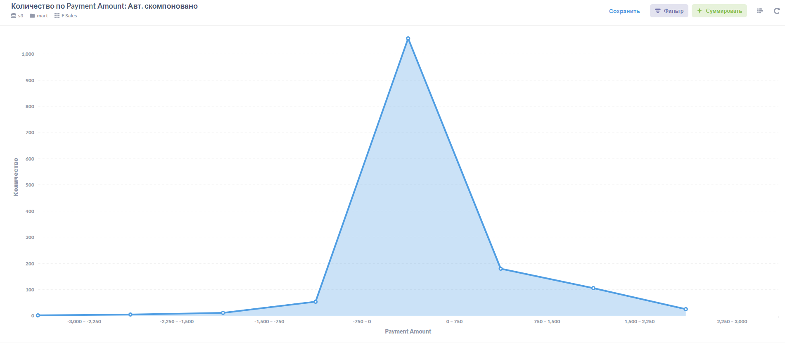

# Проект 3-го спринта


### Описание
Репозиторий предназначен для сдачи проекта 3-го спринта

### Структура репозитория
- `/migrations`
- `/src/dags`

### Схема данных, слой stg

<p float="center">
  
</p>

### Схема данных, слой cdm

<p float="center">
  
</p>

### Панель управления дагами в Airflow

<p float="center">
  
</p>

### Граф запуска тасок в Airflow

<p float="center">
  
</p>

### Графики в Metabase
<p float="left">
  
  
</p>

### Как запустить контейнер
Запустите локально команду:

```
docker run -d -p 3000:3000 -p 15432:5432 --name=de-project-sprint-3-server cr.yandex/crp1r8pht0n0gl25aug1/project-sprint-3:latest
```

После того как запустится контейнер, у вас будут доступны:
1. Visual Studio Code
2. Airflow
3. Database